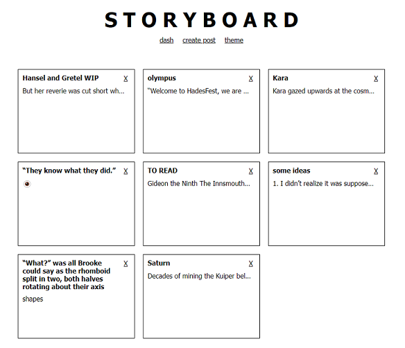
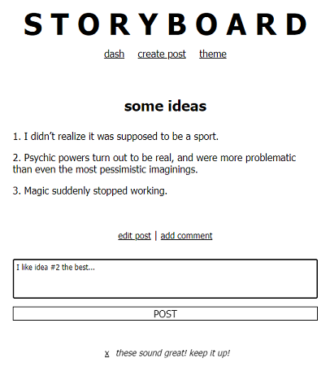

# STORYBOARD

## Summary
STORYBOARD is an interactive writer’s portfolio to post ideas / work-in-progress and offer feedback. 

## How to Get Started
1. [ ] Run this application in your local server port `3000` through the command `npm run dev` in your terminal
2. [ ] **Delete** post by clicking 'X' on post. **Create** new post by clicking 'create new post'
3. [ ] **View** full post by clicking on title. **Edit** and **comment** on post here.
4. [ ] Click on 'theme' page to change post hover color (default is lavender)

## How to Run Tests 
TBD ... 

## Stretch Features
1. [ ] User authentication and database (user ability to signup and login, view their profile, view their own saved posts and comments, add friends, view and comment on friends' posts)
1. [ ] Additional feed page that sources from external journal API and displays relevant articles on writing 
1. [ ] Improved UI design to resemble a modern-day application 
1. [ ] Refactor code to utilize React Hooks for seamless cross-component communication